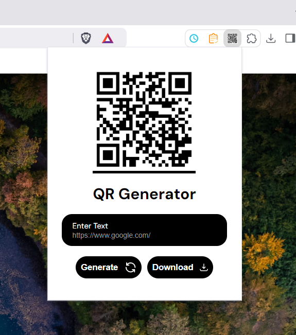

# QR Code Generator Chrome Extension

## Description
This Chrome extension allows users to generate QR codes easily by utilizing the [QR Code Generator API](https://api.qrserver.com/v1/create-qr-code/). Simply enter the desired text or URL, and the extension will generate a corresponding QR code instantly.

---

## Features
- Simple and intuitive interface.
- Generates QR codes for text and URLs,
- Quick and efficient response using the QR Code Generator API.
- Easy to install and use as a Chrome extension.

---

You can view the screenshot of the qr generator in the toolbar below:


## How to Clone and Upload the Extension

### Prerequisites
- Google Chrome installed on your computer.
- Basic knowledge of how to manage Chrome extensions.

### Steps

1. **Clone the repository:**
   ```bash
   git clone https://github.com/ajiteveryone8/chrome-extension-qr-generator

   cd chrome-extension-qr-generator

2. **Modify the manifest file if needed:**
    Ensure the manifest.json file is configured correctly for your extension. It should include the permissions and scripts required for the QR code generator.

3. **Upload the extension to Chrome:**

    Open Google Chrome.
    Go to chrome://extensions/.
    Enable "Developer mode" (toggle the switch in the top-right corner).
    Click "Load unpacked" and select the folder containing your extension files.
    Test the extension:
    
    Click the extension icon in the Chrome toolbar.
    Input text or a URL and verify that the QR code is generated.
